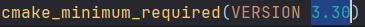

<p align="center">


</p>

<div>
<h1 align="center">StegaSaurus: Encrypted Steganography Tool</h1>
</div>

## Synopsis

StegaSaurus is a powerful steganography tool that securely hides messages using least significant bit (LSB) encoding. Before embedding, messages are encrypted with an XOR operation using a generated or supplied encryption key, adding an extra layer of security!

---

## Features


| Feature       | Description                                                                          |
| ------------- | ------------------------------------------------------------------------------------ |
| ***GUI***     | The tool comes with an easy to use GUI created with Qt                               |
| ***Key Gen*** | Generate a key and send it to a text file for later encryption/decryption            |
| ***Encrypt*** | Encrypt a message using the key and a bitwise XOR operation                          |
| ***Encode***  | Write a message and choose an image for the message to be encrypted and encoded into |
| ***Decode***  | Decode an image by extracting the inputted encrypted message                         |
| ***Decrypt*** | Use the same key as it was encrypted with to decrytp a message                       |

### GUI

The GUI allows the tool to be easily understood and operated, ensuring the user has an effortless experience.

### Encoding

The user has the options to create a secret message, generate or select a pre-existing key, and select an image of their choosing or use the default image provided. The message will then be encrypted using the key and encoded into the image, with a displacement to hide the message inside!

### Decoding

The user can select an image and a decryption key. The secret message will then be extracted out of the image and decrypted using the provided key, allowing the user to read any message that was originally encrypted using the tool.

---

## Requirements

- C++23
- CMake 3.30 (recommended)
- OpenCV 4.10.0
- Qt 6.8.2

---

## Installation

1. CMake Version

   In the CMakeLists.txt, change _cmake_minimum_required(VERSION 3.30)_ to your current version
   
2. Clone Git Repo

   ```
   git clone JAMES DONT FORGET TO PUT THE LINK HERE
   cd 13764108_IPA_A1
   ```
3. Create build directory

   ```
   mkdir build && cd build
   ```
4. Configure CMake

   ```
   cmake ..
   ```
5. Build StegaSaurus Tool

   ```
   cmake --build .
   ```
6. Run Tool

   ```
   ./13764108_IPA_A1
   ```

---

## How to Operate

When the tool is launched, a window with three options will appear:

1. Encode
2. Decode
3. Exit

### 1. Encode

- Use the **select image** button to open your file system and select a PNG image. If not is selected, the _default.png_ image is used
- Use the **generate key** button to generate a random secure key and send it to a text file named _aes_key.txt_
- Use the **select key** button to select a pre-existing key inside a text fie
- Use the **message** input box to enter your secret message, the character limit will already be set once the image is provided
- Use the **encode image** button to generate the encoded image, which will be sent to _yourImageName_encoded.png_

### 2. Decode

- Use the **select image** button to open your file system and select an encoded PNG image
- Use the **select key** button to select a text file containing a decryption key such as _aes_key.txt_
- Use the **decode image** button to decode and decrypt the message within the image and display it within the text box

### Video Tutorial

[StegaSaurus Video Tutorial](https://youtu.be/OfwEEVoCsmY)

---

## Testing

### Unit Testing


| Test Item  | Test Case        | Description                                                     | Expected Outcome                              | Pass/Fail  |
| ---------- | ---------------- | --------------------------------------------------------------- | --------------------------------------------- | ---------- |
| encode     | ValidImage       | The encode function ensures a valid image is used               | encoder launches                              | <center>✅ |
| encode     | ImageCreation    | The encoder correctly creates the encoded image with _encoded   | "image_name"_encoded.png exists               | <center>✅ |
| encode     | ImageEncode      | The encoder generated a new, encoded image                      | source image and encoded image are different  | <center>✅ |
| decode     | ValidImage       | The decoder ensures a valid image is used                       | decoder launches                              | <center>✅ |
| decode     | ImageDecode      | The decoder successfully extracts the message from the image    | test message is the same as extracted message | <center>✅ |
| encryption | GeneratedKey     | The key is successfully generated                               | key generation successfully runs              | <center>✅ |
| encryption | StoredKey        | The key is stored in a text file names aes_key.txt              | key file exists                               | <center>✅ |
| encryption | EncryptedMessage | The message is encrypted                                        | encrypted message exists                      | <center>✅ |
| decryption | ValidKey         | The decrypter successfully opens a key file such as aes_key.txt | decrypter launches                            | <center>✅ |
| decryption | DecryptedMessage | The decrypter decrypts the message correctly                    | test message is the same as decrypted message | <center>✅ |

### Integration Testing


| Test Case             | Description                                                                                         | Pass/Fail |
|-----------------------|-----------------------------------------------------------------------------------------------------|-----------|
| GUI Navigation        | User is able to open the encode or decode window from the main page                                 | <center>✅ |
| Encode Image Input    | User is able to select an image using the encode window                                             | <center>✅ |
| Encode Key Generation | User is able to generate an encryption key use the generate key button                              | <center>✅ |
| Encode Key Input      | User is able to select a pre-existing key using the associated button                               | <center>✅ |
| Encode Message Input  | User can enter a message into the text box                                                          | <center>✅ |
| Encode                | User can encode using the image, key and message provided. If no image is provided, use the default | <center>✅ |
| Decode Image Input    | User can input an encoded image using the decode window                                             | <center>✅ |
| Decode Key Input      | User can select an encryption key to decrypt with                                                   | <center>✅ |
| Decode                | User can decode the message out of the image and read the message in the text box at the bottom     | <center>✅ |
